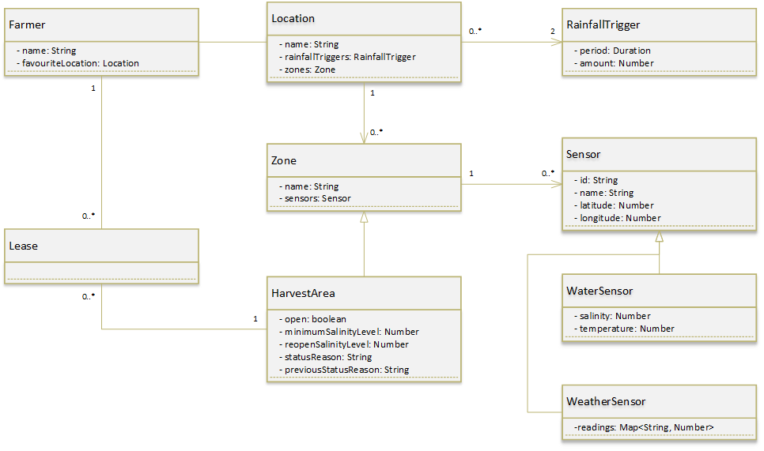

# Clyde River Dashboard Application: Requirement Model

## Document Control

| Version | Changes                                           | Author      | Date       |
| ------- | ------------------------------------------------- | ----------- | ---------- |
| 0.1     | Document format conversion from MS Word           | Sam Johnson | 2021-04-03 |
| 1.0     | Updated requirements, use cases, and domain model | Sam Johnson | 2021-04-22 |
|         |                                                   |             |            |

## Table of Contents

[TOC]

## Overview

### Background

In 2018 the New South Wales Department of Primary Industries (DPI) launched the Climate Smart Pilots project as part of its Climate Change Research Strategy (reference https://www.farmdecisiontech.net.au/climate-smart-pilots/). The project aims to use digital technology to help NSW farmers make informed management decisions and adapt to a changing climate.
The Clyde River Dashboard is a pilot project developed to provide water quality and environmental sensor information to the oyster industry. This assists the oyster farmers in making decisions as they move stock and provides “an early warning of extreme temperature events” (reference https://www.farmdecisiontech.net.au/climate-smart-pilots/).

The commercial oyster production in NSW "occurs in 41 estuaries between Eden in the south to the Tweed River in the north" (reference https://www.dpi.nsw.gov.au/fishing/aquaculture/publications/oysters/oyster-industry-in-nsw). Several different oyster species and cultivation techniques are employed. Oysters are affected by water quality and environmental stresses so commercial production is regulated by the mandatory NSW Shellfish Quality Assurance Program. Within each estuary the NSW Food Authority specifies harvest areas where oysters can be grown (reference https://www.foodauthority.nsw.gov.au/industry/shellfish). A harvest area management plan specifies the environmental conditions under which a harvest area can safely operate. In the Clyde River estuary there are three harvest areas: Moonlight, Rocky Point, and Waterfall. 

The sensors distributed throughout the Clyde River estuary by the Climate Smart Pilots project cover all three harvest areas. The data from all sensors may be relevant to a grower with stock in one harvest area. For example, rainfall may cause a lowering of salinity levels detected by upstream sensors. Equally, a rising tide may cause salinity levels to rise and would first be detected downstream.

### Project 

This project aims to give the oyster industry better access to the data developed for the Clyde River Dashboard. The current dashboard has several aspects that make it not user friendly. The Climate Smart Projects branch would like to see a mobile application or a web application that is accessible on mobile devices that can present the current sensor data in a user friendly way.

## Functional Requirements

### High Priority

- The system shall allow farmers to view the current salinity level recorded by a water quality sensor.
- The system shall allow farmers to view the current temperature recorded by a water quality sensor.
- The system shall allow farmers to view the salinity levels for a specified time period as recorded by a water quality sensor.
- The system shall allow farmers to view the temperatures for a specified time period as recorded by a water quality sensor.
- The system shall allow farmers to view the current conditions for a location. This will include information on the temperature, ‘feels like’ temperature, humidity, wind speed, wind gust, rain, light, and lightning strikes subject to the availability of weather sensors.
- The system shall allow farmers to view the precipitation for a specified time period as recorded for a location.
- The system shall allow farmers to see sensor locations on a map.

### Medium Priority

- The system shall allow farmers to view the current salinity levels recorded by all water quality sensors in the estuary.  Salinity levels from upstream and downstream of a farmers lease.
- The system shall allow farmers to view the current temperature levels recorded by all water quality sensors in the estuary. 
- The system shall allow farmers to view the wind speed and wind gusts for a specified time period as recorded for a location.
- The system shall allow farmers to view the air temperature and relative humidity for a specified time period as recorded for a location.
- The system shall allow farmers to view the amount of sunshine and diffused light for a specified time period as recorded for a location.
- The system shall allow farmers to view the atmospheric pressure for a specified time period as recorded for a location.
- The system shall allow farmers to see if salinity has fallen below or exceed defined limits. Farmers will use this information to understand why a harvest area may be closed or open.
- The system shall allow farmers to see if rainfall has exceeded the defined 7 day limit. Farmers will use this information to understand why a harvest area may be closed.
- The system shall allow farmers to see if rainfall has exceeded the defined 24 hour limit. Farmers will use this information to understand why a harvest area may be closed.
- The system shall allow farmers to see a list all water quality sensors for an estuary. This will allow the farmer to select an individual sensor.

### Low Priority

- The system shall allow farmers to select a location. The system would use the selection to display sensor information from that location.
- The system shall allow farmers to set a favourite location. This favourite setting will be stored and used when the application is opened to set the default location
- The system shall allow farmers to view the current favourite location setting.

## Non Functional Requirements

### High Priority

#### Availability

- The system will be publicly accessible. 
- The system shall allow farmers to access the application on Android devices.
- The system shall allow farmers to access the application on iOS devices.
- The application will be highly available, durable, scalable, and cost effective.

#### Usability

- The system should comply with and utilise Android design conventions and styles on Android devices.
- The system should comply with and utilise iOS design conventions and styles on iOS devices.
- The system should be usable on modern phones.
- The system should be usable on modern tablets.
- The application should adjust the interface to suit the device size and orientation.

#### Security

- Farmers should not have to authenticate to see public sensors.
- The application will obfuscate the credentials used for authorising requests to APIs

#### Supportability

- The application build and deployment processes will be automated
- The application technology stack will be maintainable for staff employed at the Department of Primary Industries

#### Interfaces

- The application will integrate and utilise the FarmDecisionTech REST API

### Medium Priority

#### Availability

- Farmers may be able to access the application using a web browser

#### Usability

- The interface should indicate when data is being retrieved

#### Performance

- The interface should display graph information within 10 seconds

#### Supportability

- The application build and deployment processes will be automated

### Low Priority

#### Interfaces

- The interface will filter erroneous and outlier data points

## Model

### Location

Locations are estuaries where commercial oyster production occurs. Within each location there are a number of zones. 

The FarmDecisionTech API defines a similar object called a 'Site'.

### Zone

A zone is an area within a location (estuary). Most zones are harvest areas, but there may be other areas of the estuary that contain sensors that aren't in a harvest area. 

This is defined by the  FarmDecisionTech API as a 'Zone'.

### Harvest Area

A harvest area is where oyster farmers have leases for producing oysters. Within the system a harvest area is a type of zone. Harvest areas have a management plan that dictates the rainfall, salinity, and temperature triggers that cause the harvest area to close or open for oyster production. Harvest areas may also be closed for other reasons, such as a sewerage spill.

### Sensor

A sensor is a unit that provides measurements of current conditions. Sensors can provide historical data. Each sensor belongs to a zone.

Sensors map to 'Devices' in the  FarmDecisionTech API.

### Water Sensor

A water quality sensor usually provides salinity, temperature, and total dissolved salts measurements. There may be different types of water sensor that vary in the information they provide.

### Weather Sensor

A weather station sensor provides weather information. Different weather sensors have different combinations of sensors that collect readings. One or more weather sensors may be combined to present a complete picture of a location's environmental conditions.

### Rainfall Trigger

There are defined rainfall triggers for closing an estuary (location) for oyster production. Currently there is a 24 hour and seven day trigger.

### Farmer

A farmer is a person involved in commercial oyster production. Farmers are users of the system who have preferences regarding the information displayed.

### Lease

Leases are areas within a harvest area which a farmer stores stock (oysters). Farmers can install water sensors on the oyster beds in their lease to track water quality. These sensors will not be included in the application scope. Leases indicate the farmer's relationship with a harvest area and through that a location. They are included in this domain model to describe the relationship but may not be directly implemented in the resulting system.

## Use Cases

### View Estuary Water Quality
**Brief Description**

A oyster farmer wants to view current water quality information for an estuary. This includes salinity and temperature levels from multiple locations. 

**Actor Brief Descriptions**
- Farmer: An oyster farmer who uses the information provided by the system to make better farm management decisions.

**Preconditions**

- A current location (estuary) is known

**Basic Flow of Events**

| Farmer               | System                                                       |
| -------------------- | ------------------------------------------------------------ |
| 1. Opens application | 2. Displays page containing graph of water quality information for all estuary sensors |

**Key Scenarios**
<scenario 1>
**Post-conditions**
<post-condition 1>
**Additional Information**

### View Environmental Conditions

**Brief Description**

A oyster farmer wants to view current environmental conditions for an estuary. This includes temperature, rainfall, wind, and wind gust information. 

**Actor Brief Descriptions**

- Farmer: An oyster farmer who uses the information provided by the system to make better farm management decisions.

**Preconditions**

- A current location (estuary) is known

**Basic Flow of Events**

| Farmer               | System                                                       |
| -------------------- | ------------------------------------------------------------ |
| 1. Opens application | 2. Displays page containing readings and graphs of current environmental information |
|                      |                                                              |
|                      |                                                              |

**Key Scenarios**
<scenario 1>
**Post-conditions**

- Current environmental conditions displayed

**Additional Information**

### View Sensor

**Brief Description**

A oyster farmer wants to view current water quality information for an individual sensor. This includes salinity, temperature, and other sensor information such as the name and location of the sensor. 

**Actor Brief Descriptions**

- Farmer: An oyster farmer who uses the information provided by the system to make better farm management decisions.

**Preconditions**

- A current location (estuary) is known

**Basic Flow of Events**

| Farmer                             | System                                                       |
| ---------------------------------- | ------------------------------------------------------------ |
| 1. Opens application               | 2. Displays page containing graph of water quality information for all estuary sensors |
| 3. Clicks/Taps water quality graph | 4. Displays list of water quality sensors                    |
| 5. Selects sensor                  | 6. Displays sensor information                               |

**Alternative Flows**

At step 3, the user instead switches to a map view and selects a sensor, resumes at step 5.

| Farmer                    | System                                                       |
| ------------------------- | ------------------------------------------------------------ |
| 3.1. Switches to Map view | 3.2. Displays map with sensors in the current location marked |

**Key Scenarios**
<scenario 1>
**Post-conditions**

- Sensor information is displayed

**Extension Points**
Select Sensor From Map: View Map of Sensors

**Additional Information**

### View Sensor History

**Brief Description**

A oyster farmer wants to view past information for an individual sensor. This includes salinity and temperature for a defined period. 

**Actor Brief Descriptions**

- Farmer: An oyster farmer who uses the information provided by the system to make better farm management decisions.

**Preconditions**

- Sensor information is displayed (as per View Sensor use case)

**Basic Flow of Events**

| Farmer                    | System                                                       |
| ------------------------- | ------------------------------------------------------------ |
| 1. Selects history option | 2. Displays page containing graph of water quality information for default period of time |

**Alternative Flows**

After step 2, the user changes the defined period of time. End of flow ends the use case

| Farmer                      | System                                                       |
| --------------------------- | ------------------------------------------------------------ |
| 2.1. Selects new start date | 2.2. Checks that the selected start date is before the end date and before the current date |
|                             | 2.3. Displays page containing graph of water quality information for the defined period of time |
| 2.4. Selects new end date   | 2.5. Checks that the selected start date is after the start date and not greater than the current date |
|                             | 2.6. Displays page containing graph of water quality information for the defined period of time |

**Exception Flows**

Selected start date is after the selected end date and is before the current date at step 2.2 of the alternate flow: 

| Farmer | System                                                       |
| ------ | ------------------------------------------------------------ |
|        | 2.2.1. Sets the selected end date to the day after the selected start date |

Selected start date is equal to or after the current date at step 2.2 of the alternate flow: 

| Farmer | System                                                       |
| ------ | ------------------------------------------------------------ |
|        | 2.2.1. Prevents the start date from changing and alerts the farmer that the date must be a date before the current date |

Selected end date is before the selected start date at step 2.5 of the alternate flow: 

| Farmer | System                                                       |
| ------ | ------------------------------------------------------------ |
|        | 2.5.1. Sets the selected start date to the day before the selected start date |

Selected end date is after the current date at step 2.5 of the alternate flow: 

| Farmer | System                                                       |
| ------ | ------------------------------------------------------------ |
|        | 2.5.1. Prevents the end date from changing and alerts the farmer that the date must be a date before or equal to the current date |

**Key Scenarios**
<scenario 1>
**Post-conditions**

- Sensor history information for the defined period is displayed

**Additional Information**

### View Environmental History

**Brief Description**

A oyster farmer wants to view past temperature, rainfall, wind, and wind gust information for a defined period.

**Actor Brief Descriptions**

- Farmer: An oyster farmer who uses the information provided by the system to make better farm management decisions.

**Preconditions**

- Current environmental conditions displayed

**Basic Flow of Events**

| Farmer                    | System                                                       |
| ------------------------- | ------------------------------------------------------------ |
| 1. Selects history option | 2. Displays page containing graphs of environmental information for a default period of time |

**Alternative Flows**

After step 2, the user changes the defined period of time. End of flow ends the use case

| Farmer                      | System                                                       |
| --------------------------- | ------------------------------------------------------------ |
| 2.1. Selects new start date | 2.2. Checks that the selected start date is before the end date and before the current date |
|                             | 2.3. Displays page containing graph of environmental information for the defined period of time |
| 2.4. Selects new end date   | 2.5. Checks that the selected start date is after the start date and not greater than the current date |
|                             | 2.6. Displays page containing graph of environmental information for the defined period of time |

**Exception Flows**

Selected start date is after the selected end date and is before the current date at step 2.2 of the alternate flow: 

| Farmer | System                                                       |
| ------ | ------------------------------------------------------------ |
|        | 2.2.1. Sets the selected end date to the day after the selected start date |

Selected start date is equal to or after the current date at step 2.2 of the alternate flow: 

| Farmer | System                                                       |
| ------ | ------------------------------------------------------------ |
|        | 2.2.1. Prevents the start date from changing and alerts the farmer that the date must be a date before the current date |

Selected end date is before the selected start date at step 2.5 of the alternate flow: 

| Farmer | System                                                       |
| ------ | ------------------------------------------------------------ |
|        | 2.5.1. Sets the selected start date to the day before the selected start date |

Selected end date is after the current date at step 2.5 of the alternate flow: 

| Farmer | System                                                       |
| ------ | ------------------------------------------------------------ |
|        | 2.5.1. Prevents the end date from changing and alerts the farmer that the date must be a date before or equal to the current date |

**Key Scenarios**
<scenario 1>
**Post-conditions**

- Historical environmental information for the defined period is displayed

**Additional Information**

### View Rainfall Triggers

**Brief Description**

A oyster farmer wants to view cumulative rainfall for the periods that are defined in the harvest area management plans as triggers to close the harvest area. For example: rainfall over the past 24 hours and seven days.

**Actor Brief Descriptions**

- Farmer: An oyster farmer who uses the information provided by the system to make better farm management decisions.

**Preconditions**

- A current location (estuary) is known

**Basic Flow of Events**

| Farmer               | System                                                       |
| -------------------- | ------------------------------------------------------------ |
| 1. Opens application | 2. Displays a cumulative rainfall figure for each defined time period |

**Key Scenarios**
<scenario 1>
**Post-conditions**

- Rainfall for defined periods is displayed

**Additional Information**

### Set Current Location
**Brief Description**

A location has not been set or the farmer wants to change the current location.

**Actor Brief Descriptions**
- Farmer: An oyster farmer who uses the information provided by the system to make better farm management decisions.

**Preconditions**

- None

**Basic Flow of Events**

| Farmer                              | System                                                       |
| ----------------------------------- | ------------------------------------------------------------ |
| 1. Opens application                | 2. Name of the current location (estuary) is displayed on the screen |
| 3. Clicks/Taps the current location | 4. <begin Select Location use case>                          |
|                                     | 5. Sets selected location as the favourite location          |

**Alternative Flows**
If at Step 2, no current location is defined, the user is prompted to select a location. Flow resumes at Step 4.

| Farmer                               | System                                                       |
| ------------------------------------ | ------------------------------------------------------------ |
|                                      | 2.1. Displays a message asking the user to select a current location with the following text: "Please select a location".  Displays a location text field and map icon button. |
| 2.2. Clicks/Taps the location button |                                                              |

**Subflows**
Subflow: Select Location
**Key Scenarios**
<scenario 1>
**Post-conditions**

The current location is updated to reflect the newly selected location.

**Additional Information**

### Add Favourite Location

**Brief Description**

The farmer wants to change the default location used when opening the application.

**Actor Brief Descriptions**

- Farmer: An oyster farmer who uses the information provided by the system to make better farm management decisions.

**Preconditions**

- Application launched

**Basic Flow of Events**

| Farmer                              | System                              |
| ----------------------------------- | ----------------------------------- |
| 1. Opens application preferences    | 2. Displays preferences screen      |
| 3. Selects default location setting | 4. <begin Select Location use case> |
|                                     |                                     |

**Alternative Flows**
<alternate flow 1>

**Subflows**
Subflow: Select Location

**Key Scenarios**
<scenario 1>
**Post-conditions**
The default location is updated to reflect the newly selected location.

**Additional Information**

### Subflow: Select Location

**Brief Description**

A location has not been set or the farmer wants to change the current location.

**Actor Brief Descriptions**

- Farmer: An oyster farmer who uses the information provided by the system to make better farm management decisions.

**Preconditions**

- None

**Basic Flow of Events**

| Farmer                                     | System                                                    |
| ------------------------------------------ | --------------------------------------------------------- |
|                                            | 1. Displays list of estuary locations with active sensors |
| 2. Clicks or taps a location from the list |                                                           |

**Alternative Flows**
If at Step 2, the user would prefer to select from a map, the user selects the map. Flow ends the use case.

| Farmer                                 | System |
| -------------------------------------- | ------ |
| <begin View Map of Locations use case> |        |
|                                        |        |

**Key Scenarios**
<scenario 1>
**Post-conditions**
A location has been selected.
**Extension Points**
Select Location From Map: View Map of Locations

**Additional Information**

### View Map of Locations

**Brief Description**

The farmer is selecting a location and wants to view a map of locations.

**Actor Brief Descriptions**

- Farmer: An oyster farmer who uses the information provided by the system to make better farm management decisions.

**Preconditions**

- Farmer is selecting a location

**Basic Flow of Events**

| Farmer                                                  | System                                                       |
| ------------------------------------------------------- | ------------------------------------------------------------ |
| 1. Selects the Map option                               | 2. Displays a map view centered on the user's current location. Available locations are indicated with an icon and a name. |
| 3. User manipulates the map to display desired location |                                                              |
| 4. User selects a location                              |                                                              |

**Alternative Flows**
<alternate flow 1>

**Subflows**

**Key Scenarios**
<scenario 1>
**Post-conditions**

- A location has been selected

**Additional Information**

### View Map of Sensors

**Brief Description**

The farmer wants to view a map showing the locations of sensors including basic information about readings.

**Actor Brief Descriptions**

- Farmer: An oyster farmer who uses the information provided by the system to make better farm management decisions.

**Preconditions**

- Application is open
- A location has been set
- Location overview is displayed

**Basic Flow of Events**

| Farmer         | System                                                       |
| -------------- | ------------------------------------------------------------ |
| 1. Selects Map | 2. Displays map centered on the current location             |
|                | 3. Displays water quality sensor locations with salinity and temperature information |
|                | 4. Displays weather sensor location with current temperature |

**Alternative Flows**

**Subflows**
<subflow 1>
**Key Scenarios**
<scenario 1>
**Post-conditions**
<post-condition 1>
**Extension Points**
<extension point 1>
**Special Requirements**
<supplementary requirement 1>
**Additional Information**

## References

https://www.farmdecisiontech.net.au/climate-smart-pilots/

## Appendix A: Estuaries

NSW estuaries and their harvest areas used for commercial oyster production:

| Estuary | Harvest Areas |
| ------- | ------------ |
| Bega River |              |
| Bellinger River |              |
| Bermagui River |              |
| Brisbane Waters |              |
| Brunswick River |              |
| Burrill Lake |              |
| Camden Haven |              |
| Clarence River |              |
| Clyde River | Moonlight, Rocky Point, Waterfall |
| Conjola Lake |              |
| Crookhaven River |              |
| Georges River |              |
| Hastings River |              |
| Hawkesbury River |              |
| Hunter River |              |
| Macleay River |              |
| Manning River North |              |
| Maning River South |              |
| Merimbula Lake |              |
| Moruya River |              |
| Nambuca River |              |
| Nelson Lagoon |              |
| Pambula River |              |
| Port Stephens Karuah |              |
| Port Stephens Salamander Bay |              |
| Port Stephens Tea Gardens |              |
| Port Stephens Tilligery Creek |              |
| Port Stephens - West |              |
| Richmond River |              |
| Sandon River |              |
| Shoalhaven River |              |
| Tomago River |              |
| Tuross Lake |              |
| Tweed River |              |
| Wagonga Inlet |              |
| Wallaga Lake |              |
| Wallis Lake |              |
| Wapengo Lake |              |
| Wonboyn Lake |              |
| Wooli Wooli |              |

