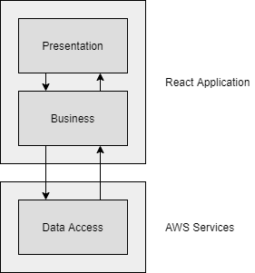
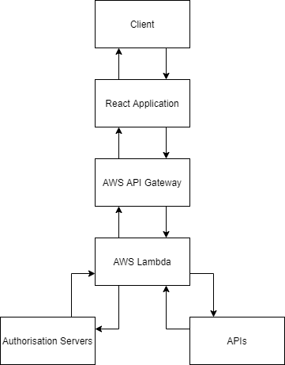
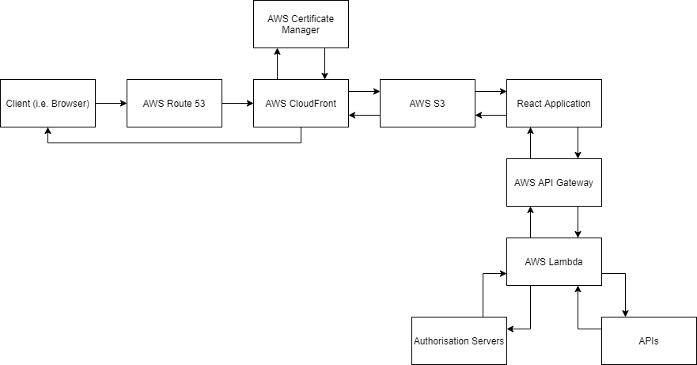
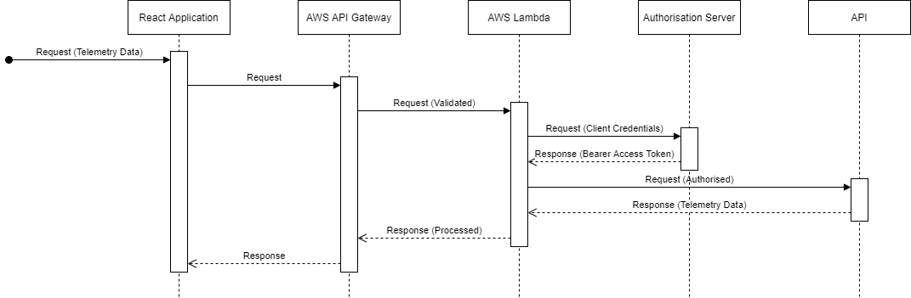
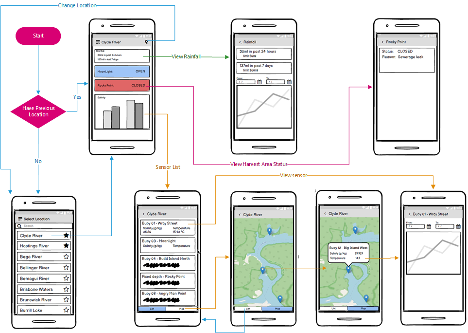

# Clyde River Dashboard Summary

As of 2021-04-25 (end of the inception phase).

## Contents

* [Introduction](#introduction)
* [Requirements](#requirements)
    * [Functional](#functional)
    * [Non-Functional](#non-functional)
* [Architecture](#architecture)
    * [Architectural Goals and Philosophy](#architectural-goals-and-philosophy)
    * [Assumptions and Dependencies](#assumptions-and-dependencies)
    * [Architecturally Significant Requirements](#architecturally-significant-requirements)
    * [Decisions, Constraints, and Justifications](#decisions-constraints-and-justifications)
    * [Architectural Mechanisms](#architectural-mechanisms)
    * [Architectural Layers](#architectural-layers)
    * [Architectural Views](#architectural-views)
* [Wireframes](#wireframes)

## Introduction

The key goal of the Clyde River Dashboard project is to process device and sensor telemetry data (which relates to the environmental characteristics of the estuaries and surrounding areas) and display it in a meaningful format for oyster farmers to facilitate their operations. To achieve this, the proposed application will be cross-device and cross-platform compatible, and designed and developed to be intuitive for the end-user with the goal of increasing adoption of the platform.

## Requirements

### Functional

#### High Priority

* The system shall allow farmers to view the current water salinity level as recorded by a water quality sensor.
* The system shall allow farmers to view the current water temperature as recorded by a water quality sensor.
* The system shall allow farmers to view the water salinity levels for a specified time period as recorded by a water quality sensor.
* The system shall allow farmers to view the water temperatures for a specified time period as recorded by a water quality sensor.
* The system shall allow farmers to view the current environmental conditions for a location. This will include information on the temperature, "feels like" temperature, humidity, wind speed, wind gust, rain, light, and lightning strikes subject to the availability of weather sensors.
* The system shall allow farmers to view the precipitation for a specified time period as recorded for a location.
* The system shall allow farmers to see sensor locations on a map.

#### Medium Priority

* The system shall allow farmers to view the current water salinity levels as recorded by all water quality sensors (inclusive of upstream and downstream of a farmer's lease) in the estuary.
* The system shall allow farmers to view the current water temperature levels as recorded by all water quality sensors in the estuary.
* The system shall allow farmers to view the wind speed and wind gusts for a specified time period as recorded for a location.
* The system shall allow farmers to view the air temperature and relative humidity for a specified time period as recorded for a location.
* The system shall allow farmers to view the amount of sunshine and diffused light for a specified time period as recorded for a location.
* The system shall allow farmers to view the atmospheric pressure for a specified time period as recorded for a location.
* The system shall allow farmers to see if water salinity levels are outside of the defined range. Farmers will use this information to understand why a harvest area may be closed or opened.
* The system shall allow farmers to see if rainfall has exceeded the defined weekly limit. Farmers will use this information to understand why a harvest area may be closed.
* The system shall allow farmers to see if rainfall has exceeded the defined daily limit. Farmers will use this information to understand why a harvest area may be closed.
* The system shall allow farmers to see a list all water quality sensors for an estuary. This will allow the farmer to select an individual sensor.

#### Low Priority

* The system shall allow farmers to select a location. The system would use the selection to display sensor information specific to that location.
* The system shall allow farmers to set one or more favourite locations.
* The system shall automatically load the previously accessed location upon application startup.

### Non-Functional

#### High Priority

##### Availability

* The system will be publicly accessible (i.e. without registration or authentication).
* The system shall allow farmers to access the application on Android devices.
* The system shall allow farmers to access the application on iOS devices.
* The application will be highly available, durable, scalable, and cost effective.

##### Usability

* The system should comply with and utilise Android design conventions and styles on Android devices.
* The system should comply with and utilise iOS design conventions and styles on iOS devices.
* The system should be usable on modern phones.
* The system should be usable on modern tablets.
* The application should adjust the interface to suit the device size and orientation.

##### Security

* Farmers should not have to register or authenticate to see public sensors.
* The application will obfuscate the client credentials used for authorising requests to the FarmDecisionTech REST API.

##### Supportability

* The application build, testing, and deployment processes will be automated.
* The application technology stack will be maintainable for staff employed at the Department of Primary Industries.

##### Interfaces

* The application will integrate and utilise the FarmDecisionTech REST API.

#### Medium Priority

##### Availability

* Farmers may be able to access the application on any device with a modern web browser installed.

##### Usability

* The interface should indicate when data is being retrieved.

##### Performance

* The interface should display graph information within 10 seconds.

#### Low Priority

##### Interfaces

* The interface will filter erroneous and outlier data points.

## Architecture

### Architectural Goals and Philosophy

* The dashboard will be publicly accessible and the end-user will not have to authenticate by providing security credentials.
* The dashboard will be intuitive for the end-user.
* The dashboard will display the device and sensor telemetry data in a meaningful format and expand on the capabilities of the [existing dashboard](https://www.farmdecisiontech.net.au/clyde-river-dashboard/).
* The dashboard may provide additional telemetry data (e.g. tide heights and times, weather forecasts, etc.).
* The dashboard will visually indicate when the telemetry data is being requested and processed, and will gracefully handle unsuccessful requests (e.g. exceeded quota, failed authorisation, timeout, etc.).
* The dashboard will display cached telemetry data (if available) when internet connectivity is unavailable on the end-user's device.
* The dashboard will filter erroneous and outlier data points.
* The dashboard theme will be consistent with other Department of Primary Industries and New South Wales (NSW) Government applications and products.
* The dashboard layout will be responsive and progressively enhanced based on the capabilities, resolution, and scale of the end-user's device.
* The dashboard theme and and associated components will be adaptive to be consistent with the platform of the end-user's device.
* The dashboard will be distributed as a web application that is accessible on any device with a modern web browser.
* The dashboard will be distributed as a compiled native application for mobile platforms (i.e. Android and iOS) that is accessible on associated phone and tablet devices.
* The dashboard will integrate and utilise the [FarmDecisionTech Representational State Transfer (REST) Application Programming Interface (API)](https://www.farmdecisiontech.net.au/farmdecisiontech-api/).
* The dashboard will obfuscate the client credentials (OAuth 2.0) used for authorising requests to the [FarmDecisionTech REST API](https://www.farmdecisiontech.net.au/farmdecisiontech-api/).
* The dashboard will be performant and reduce latency regardless of the end-user's location.
* The dashboard will be highly available, durable, scalable, and cost effective.
* The dashboard build and deployment processes will be automated.
* The dashboard technology stack will be maintainable for staff employed at the Department of Primary Industries.

### Assumptions and Dependencies

* The dashboard assumes that the end-user's device will have (potentially intermittently) internet connectivity (according to Telstra's network coverage map, the Clyde River area has extensive 3G and 4G coverage, as well as partial 5G coverage).
* The dashboard assumes that the end-user has limited technical capabilities, but has a basic understanding of how to operate their device (e.g. using touch gestures).
* The dashboard depends on the [FarmDecisionTech REST API](https://www.farmdecisiontech.net.au/farmdecisiontech-api/) to provide the device and sensor telemetry data.
* The dashboard depends on third-party APIs to provide additional telemetry data (e.g. tide heights and times, weather forecasts, etc.).
* The dashboard development process depends on the project team being familiar with the fundamentals of mobile and web application development.

### Architecturally Significant Requirements

* The dashboard will be publicly accessible and the end-user will not have to authenticate by providing security credentials. This will limit the device and sensor telemetry data to what is available within the public domain (i.e. any user-specific devices and sensors will be excluded).
* The dashboard will display the device and sensor telemetry data in a meaningful format and expand on the capabilities of the [existing dashboard](https://www.farmdecisiontech.net.au/clyde-river-dashboard/). This will require a charting/graphing library that is able to display the data sets as forecasts, relationships, time-series, and so on.
* The dashboard may provide additional telemetry data (e.g. tide heights and times, weather forecasts, etc.). This will require integrating and utilising third-party APIs (in addition to the [FarmDecisionTech REST API](https://www.farmdecisiontech.net.au/farmdecisiontech-api/)). Resultingly, any upstream issues (i.e. faults, outages, etc.) will need to be accounted for and appropriately handled.
* The dashboard will display cached telemetry data (if available) when internet connectivity is unavailable on the end-user's device. This will require the use of service workers.
* The dashboard will filter erroneous and outlier data points. This will require processing (i.e. validating, sanitising, and removing) the device and sensor telemetry data retrieved from the [FarmDecisionTech REST API](https://www.farmdecisiontech.net.au/farmdecisiontech-api/) in accordance with business rules that dictate the valid range of values.
* The dashboard layout will be responsive and progressively enhanced based on the capabilities, resolution, and scale of the end-user's device. This will require device specification detection and associated styling rules (e.g. media queries and defined breakpoints).
* The dashboard will be distributed as a web application that is accessible on any device with a modern web browser, as well as a compiled native application for mobile platforms (i.e. Android and iOS) that is accessible on associated phone and tablet devices. This will require maintaining separate platform-specific codebases or utilising a framework that is compatible with (and can compile for) multiple platforms.
* The dashboard will integrate and utilise the [FarmDecisionTech REST API](https://www.farmdecisiontech.net.au/farmdecisiontech-api/). This will require the `content-type` to be JavaScript Object Notation (JSON), specifically `application/json`, for associated requests and responses. Additionally, any upstream issues (i.e. faults, outages, etc.) will need to be accounted for and appropriately handled.
* The dashboard will obfuscate the client credentials (OAuth 2.0) used for authorising requests to the [FarmDecisionTech REST API](https://www.farmdecisiontech.net.au/farmdecisiontech-api/). This will require an intermediary back-end (i.e. server-side) application that acts as a proxy between the dashboard single page application (SPA) and the [FarmDecisionTech REST API](https://www.farmdecisiontech.net.au/farmdecisiontech-api/) (and, possibly, third-party APIs), as the client credentials (and the associated bearer access token used within the `authorization` request header) cannot otherwise be obfuscated due to the untrusted nature of front-end (i.e. client-side) applications.
* The dashboard will be performant and reduce latency regardless of the end-user's location. This will require deployment to a content delivery network (CDN) which comprises of multiple data centres located within geographically distinct regions and has caching capabilities.
* The dashboard will be highly available, durable, scalable, and cost effective. This will require a load balancer that evenly distributes the traffic between a group of application instances that can be horizontally scaled on-demand. Additionally, the storage medium will need to be configured with redundancy that is automatically repaired when degradation of data integrity is detected.
* The dashboard build and deployment processes will be automated. This will require utilising an infrastructure as a service (IaaS) or platform as a service (PaaS) provider, which will facilitate the provisioning of resources through infrastructure as code (IaC), version control, and continuous integration continuous deployment (CI/CD) pipelines.
* The dashboard technology stack will be maintainable for staff employed at the Department of Primary Industries. This will require the use of common programming and markup languages, frameworks, and technologies that are widely adopted within the industry and have been sufficiently documented and supported.

### Decisions, Constraints, and Justifications

**Decision #1:** Amazon Web Services (AWS) will be utilised as the IaaS/PaaS provider, who offers the following benefits and services:

* On-demand (i.e. pay as you go) pricing with no upfront costs and free fetch requests between AWS resources, which improves cost effectiveness.
* Micro-service architecture that is loosely coupled, which improves maintainability.
* Route 53 will be used to register the custom domain name (to be determined) and create a domain name system (DNS) alias record to associate the CloudFront distribution.
* CloudFront will be used as the CDN, which is comprised of a global network of [edge locations](https://aws.amazon.com/cloudfront/features/#Global_Edge_Network) and improves performance by reducing latency (regardless of the end-user's location), minimising requests to the origin by utilising a caching layer and collapsing requests, and automatically scaling based on traffic fluctuations.
* Certificate Manager will be used to create and attach the secure sockets layer (SSL) certificate to the CloudFront distribution, facilitating secure network communications via HyperText Transfer Protocol Secure (HTTPS).
* Simple Storage Service (S3) will be used as the CloudFront origin and storage medium for the dashboard SPA, which is configured with redundancy that is automatically repaired when degradation of data integrity is detected and is able to accommodate at minimum 5,500 fetch requests per second (and more with performance optimisation techniques).
* API Gateway will be used to create an intermediary REST API which is utilised by the dashboard SPA. This allows the client credentials (and the associated bearer access token used within the `authorization` request header) for the [FarmDecisionTech REST API](https://www.farmdecisiontech.net.au/farmdecisiontech-api/) (and third-party APIs) to be obfuscated from the end-user.
* Lambda functions (which can be developed in numerous programming languages, but will use JavaScript for consistency and maintainability) will be used for business logic and data operations and attached to the API Gateway endpoints.
* CloudFormation and the associated Cloud Development Kit (CDK) will be used to automate the provisioning of resources (as detailed above) via IaC, which eliminates the manual process of doing so through the AWS Management Console or command line interface (CLI).
* CodePipeline will be used as the CI/CD pipeline, which will automate the build, test, and deployment processes.

**Justification #1:** As an alternative to AWS, a virtual private server (VPS) provider could have been opted for. However, doing so would incur upfront costs and require careful analysis of the projected usage (with regards to storage capacity and network traffic) for the application, which could be detrimental to cost effectiveness, availability, and scalability if the analysis is inaccurate. Additionally, the provisioning and management of resources would be more time consuming, shifting the focus away from the development efforts (which are paramount).

**Decision #2:** Atlassian BitBucket will be utilised for the version control repository, which offers the following benefits:

* Free private repositories.
* Integration with Atlassian Jira for project management and issue tracking.
* Compatibility with AWS CodePipeline as part of the CI/CD pipeline.

**Justification #2:** As an alternative to Atlassian BitBucket, AWS CodeCommit or GitHub could have been opted for. However, the Atlassian product suite is tightly integrated and is familiar to the project team.

**Decision #3:** React Native will be utilised as the framework for the dashboard SPA, which offers the following benefits:

* Ability to compile an application for mobile platforms (i.e. Android and iOS, both with native components) and web.
    * The [React Native Web](https://github.com/necolas/react-native-web) library is required to build the web application.
    * The [React Native Charts Wrapper](https://github.com/wuxudong/react-native-charts-wrapper) library will be used for charts and graphs.
* Based on JavaScript and uses a paradigm similar to web development, which improves maintainability.
* Uses asynchronous requests and callback functions to prevent blocking the main UI thread.
    * For requests, the `content-type` header needs to be set to `application/json` and the body needs to be "stringified" JSON.
    * For responses, the body needs to be parsed JSON.
* Widely adopted within the industry with good quality documentation.

**Justification #3:** As an alternative to React Native, Flutter or Ionic could have been opted for. However, the former uses niche technologies (such as Dart) and lacks native components for mobile platforms, where as the latter isn't as performant due to rendering via a web view component (essentially, an embedded/integrated web browser).

**Decision #4:** The dashboard theme will comply with colour, typography, and style guidelines provided by the NSW Government and the Department of Primary Industries.

**Justification #4:** This will improve the user experience by creating consistency between the dashboard and other Department of Primary Industries applications and products.

### Architectural Mechanisms

#### Auditing

Auditing will be facilitated through AWS CloudWatch, which allows logs to be created, collated, analysed, and acted upon (either automatically or manually) for other AWS services such as API Gateway, Lambda, and S3. Additionally, alarms will be created to detect anomalous behaviour (such as unsuccessful responses from the upstream APIs). Finally, profiling will be facilitated through AWS X-Ray, which assists with identifying causes of poor performance and opportunities for optimisation within applications using a micro-service architecture.

#### Authentication

Authentication is not required for the end-user due to the telemetry data being within the public domain. However, authentication (via OAuth 2.0 client credentials and associated bearer access token) will be required for requests made to the [FarmDecisionTech REST API](https://www.farmdecisiontech.net.au/farmdecisiontech-api/) by the dashboard SPA.

#### Communication

Communication between the dashboard SPA and the [FarmDecisionTech REST API](https://www.farmdecisiontech.net.au/farmdecisiontech-api/) (and, possibly, third-party APIs) will be facilitated via HTTPS. The requests/responses will be performed and handled asynchronously (i.e. non-blocking) with the `content-type` header set to `application/json` and the body (if any) containing "stringified" JSON.

#### Error Handling

Errors and exceptions (such as unsuccessful responses from the upstream APIs) will be appropriately handled to maintain a functional and predictable application state. Additionally, visual feedback will be provided to the end-user when errors and exceptions that adversely influence the user experience are encountered.

#### Persistence

Persistence of previously requested/retrieved telemetry data will be facilitated through local caching (via service workers) to account for the upstream APIs being unreachable. The local cache will persist until the next successful request/retrieval has been completed, in which case the stale telemetry data will be replaced.

#### Security

Security credentials (OAuth 2.0 client credentials and associated bearer access token) used for authorising requests to the [FarmDecisionTech REST API](https://www.farmdecisiontech.net.au/farmdecisiontech-api/) will be inaccessible to the client (i.e. end-user) to prevent potential misuse.

### Architectural Layers

The dashboard SPA will utilise a typical "n-tier" architecture consisting of three loosely coupled layers (presentation, business, and data access).

#### Presentation

The presentation layer will be responsible for handling user interaction, managing state, and rendering components. It will be developed using React Native.

#### Business (Domain)

The business layer will be responsible for processing and passing data between the presentation and data access layers, as well as managing the local cache. It will be developed using JavaScript.

#### Data Access

The data access layer will be responsible for interacting with the third-party APIs (such as the [FarmDecisionTech REST API](https://www.farmdecisiontech.net.au/farmdecisiontech-api/)). It will be developed using JavaScript and deployed via AWS services (API Gateway and Lambda).

#### Diagram

### Architectural Views

#### Deployment Diagram for Native Application

#### Deployment Diagram for Web Application

#### System Sequence Diagram for Requesting Telemetry Data

## Wireframes

